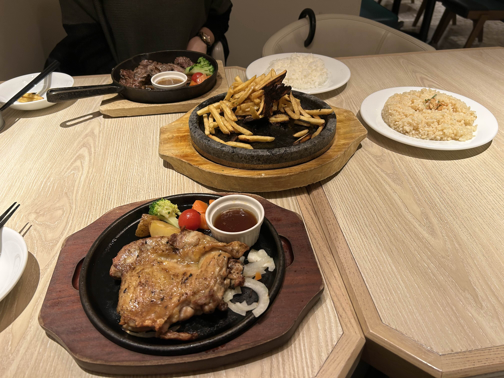

# 1000日記念サイト

彼氏との1000日記念に作成した思い出のアルバムサイトです。

## ファイル構成

\`\`\`
├── index.html        # メインページ
├── styles.css        # スタイルシート
├── images/           # 写真フォルダ
│   └── README.txt   # 画像の使い方
└── README.md        # このファイル
\`\`\`

## 記録の追加方法

### 1. テキストのみの記録

index.html の該当する年のセクション内に以下を追加：

\`\`\`html
<article class="memory-card">
    

        

            <time class="memory-date">2023年8月15日</time>
            <h3 class="memory-place">お店の名前</h3>
        

        
思い出のテキストをここに書く 改行は&lt;br&gt;で入れられます

    

</article>
\`\`\`

### 2. 写真付きの記録

\`\`\`html
<article class="memory-card">
    

        

            <time class="memory-date">2023年8月15日</time>
            <h3 class="memory-place">お店の名前</h3>
        

        
思い出のテキスト

    

    

        
    

</article>
\`\`\`

### 3. 新しい年のセクションを追加

\`\`\`html
<section class="year-section">
    

        <h2 class="year-title">2026</h2>
    

    <!-- ここに記録を追加 -->
    
</section>
\`\`\`

## GitHub Pages での公開方法

1. GitHubでリポジトリを作成
2. このフォルダの中身をすべてアップロード
3. リポジトリの Settings → Pages で公開設定
4. Source を "main" ブランチに設定
5. 数分後に `https://ユーザー名.github.io/リポジトリ名/` でアクセス可能

## カスタマイズのヒント

### タイトルを変更
index.html の `<h1 class="header-title">` と `<title>` を編集

### 色を変更
styles.css の以下の色コードを変更：
- メインカラー: #d4a373
- 背景色: #faf8f5
- テキスト: #3d3530

### フォントを変更
styles.css の `font-family` を編集

---

素敵な記念日になりますように！
